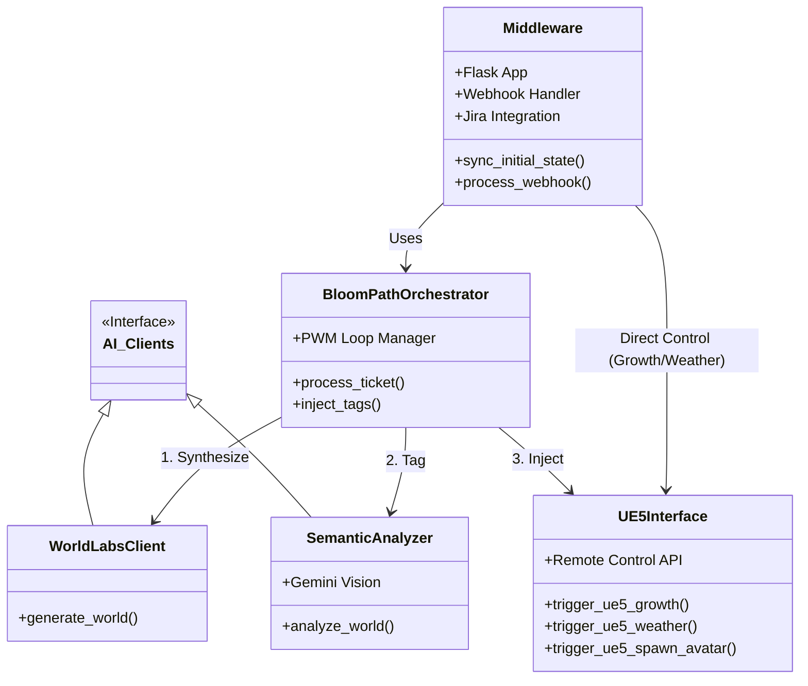
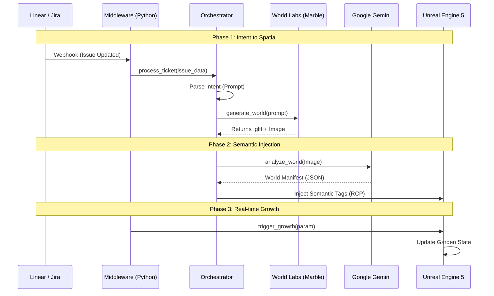

# BloomPath System Architecture

This document provides a high-level overview of the BloomPath system, illustrating the component hierarchy and the data flow between them.

## 1. Component Hierarchy

BloomPath is composed of a Python middleware layer that orchestrates communication between external services (Jira, AI Models) and the visualization engine (Unreal Engine 5).



---

## 2. Data Flow: The Project World Model (PWM) Loop

This diagram illustrates how an abstract Jira Ticket is transformed into a validated 3D Environment.



---

## 3. Data Flow: Environmental Dynamics

How project health translates to environmental weather.

```mermaid
flowchart TD
    JIRA[Jira Board] -->|Fetch Sprint Data| MID[Middleware]
    MID -->|Calculate Progress %| TIME[Time of Day]
    MID -->|Calculate Health (Blockers/Done)| WEATHER[Weather State]
    
    TIME -->|RCP: set_sun_position| UE5[Unreal Engine 5]
    WEATHER -->|RCP: set_weather_type| UE5
    
    subgraph UE5_Logic
        UE5 --> SUN[Sun & Sky Actor]
        UE5 --> NIAGARA[Rain/Storm Systems]
    end
```
