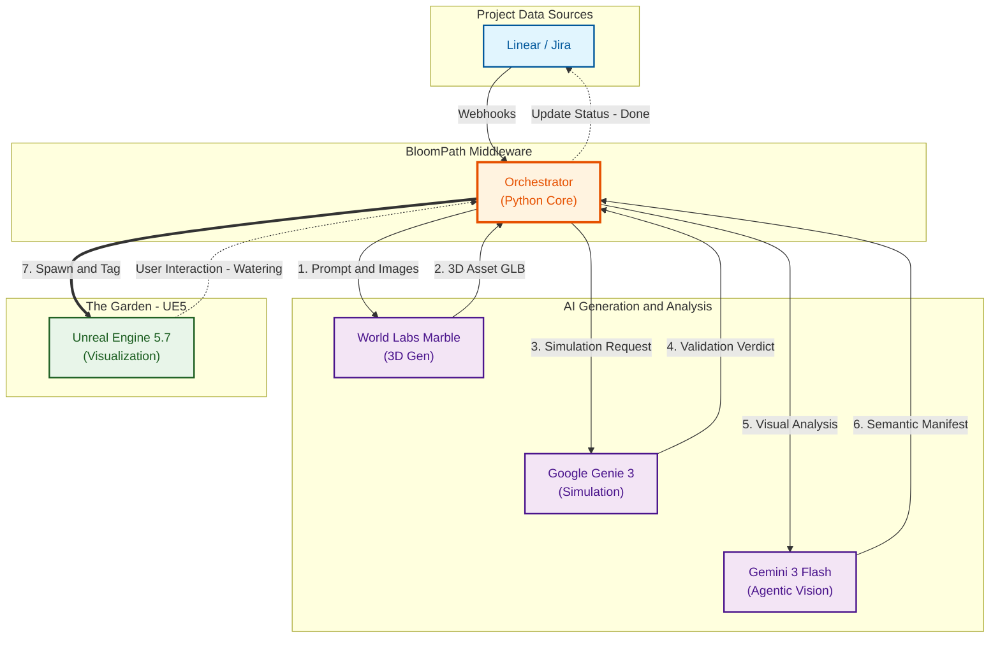

# 🌸 BloomPath: The Garden of Productivity

BloomPath is a **Digital Twin of Organization (DTO) and Simulation** that visualizes project management data (Linear/Jira) as a dynamic, immersive 3D environment in Unreal Engine 5. It bridges the gap between abstract workflows and spatial awareness.

---

## 🟢 Workflow & AI Roles


---

## 1. Organic Data Visualization
Transforms complex project data into intuitive organic growth:
- **Issues as Plants**: Each task manifests as a growing branch or leaf.
- **Organic Metadata Mapping**: 
  - **Priority ➔ Scale**: Urgent tasks appear larger.
  - **Epic ➔ Color**: Visual grouping by project area/epic.
- **Blocker Thorns**: Impediments and blocked issues manifest as thorns, providing a "glance-able" view of bottlenecks.

## 2. The PWM (Project World Model) Pipeline
A state-of-the-art AI-driven automation loop managed by the **Middleware Orchestrator**:
- **Intent Parsing**: Extracts design prompts from Linear/Jira tickets.
- **Spatial Synthesis**: Generates 3D world segments from requirements (Marble AI).
- **AI Validation (Genie 3)**: Simulates gameplay within the generated world to verify functional requirements.
- **Semantic Tagging (Gemini 3 Flash)**: Vision-based analysis that automatically injects physics and navigation data into the UE5 environment.

## 3. Environmental Intelligence (Cycle/Sprint Weather)
The atmosphere of the garden reflects the **real-time health** of the cycle/sprint:
- **Cycle/Sprint Weather**:
  - ☀️ **Sunny**: High velocity, on track.
  - ⛈️ **Stormy**: Critical blockers or behind schedule.
- **Cycle/Sprint Clock**: Time-of-day (Dawn to Sunset) maps to the current cycle/sprint progress.

## 4. Future-Proof Planning (The "Dreaming Engine")
Advanced "What-If" simulations that let the system "see" into the project's future:
- **Project Forecasting**: The garden "dreams" potential outcomes, showing how your project will likely grow based on today's trends.
- **Early-Warning Visuals**: Predicts and visualizes upcoming risks (like bottlenecks) as "storm clouds" over specific areas before they hit your board.
- **Stress-Testing**: Test "what-if" scenarios—like adding extra scope or shifting team resources—and see the visual impact on delivery immediately.
- **Smart Decision Support**: Simple summaries of best and worst-case outcomes to help teams stay proactive.

## 5. Bidirectional Interaction
A truly interactive DTO, not just a dashboard:
- **Interaction Loop**: Interacting with project elements in UE5 (e.g., watering) can trigger status transitions in Linear/Jira.
- **Avatar Presence**: Team members are represented as "Team Avatars" near their assigned tasks.
- **Spatial Audio**: Success chimes and risk notification sounds provide an immersive auditory feedback layer.

---

## 🚀 Getting Started

### 1. Setup & Installation
**Prerequisites**:
- Python 3.14+
- `ngrok` (for webhook tunneling)
- Unreal Engine 5.7.2

**Installation**:
```bash
# Clone the repository
git clone https://github.com/petolapa/BloomPath.git
cd BloomPath

# Install Python dependencies
pip install -r requirements.txt
```

**Configuration**:
1. Copy the template: `cp .env.template .env`
2. Update `.env` with your keys:
   - **Linear**: API Key, Team ID, Webhook Secret
   - **Jira**: Domain, Email, API Token
   - **AI Services**: Gemini, World Labs, etc.

> [!WARNING]
> **Security Note**: Never commit your `.env` file. It is excluded by `.gitignore` to protect your secrets.

---

### 2. Running the Application
You will need two terminal windows running simultaneously:

**Terminal 1: Middleware**
Starts the Python server to handle webhooks and game logic.
```powershell
.\start_bloompath.ps1
```

**Terminal 2: Tunnel**
Exposes your local server to the internet so Linear/Jira can reach it.
```powershell
.\start_ngrok.ps1
```
*Copy the `https` URL from the output (e.g., `https://xyz.ngrok-free.app`).*

---

### 3. Integrations Setup

#### Linear Webhooks
1. Go to your Linear Workspace Settings -> API -> Webhooks.
2. Create a new webhook.
3. **URL**: Paste your ngrok URL and append `/webhooks/linear` (e.g., `https://xyz.ngrok-free.app/webhooks/linear`).
4. **Events**: Select "Issues" (Create, Update).
5. **Secret**: Copy the "Signing secret" (`lin_wh_...`) into your `.env`.

---

### 🛠️ Technical Stack
- **Engine**: Unreal Engine 5.7.2 (Remote Control API, Niagara, glTFRuntime)
- **Intelligence**: Google Gemini 3 Flash (Vision), Google Genie 3 (World Simulation), World Labs API (Marble AI)
- **Infrastructure**: Python Middleware, Linear/Jira Cloud API.
