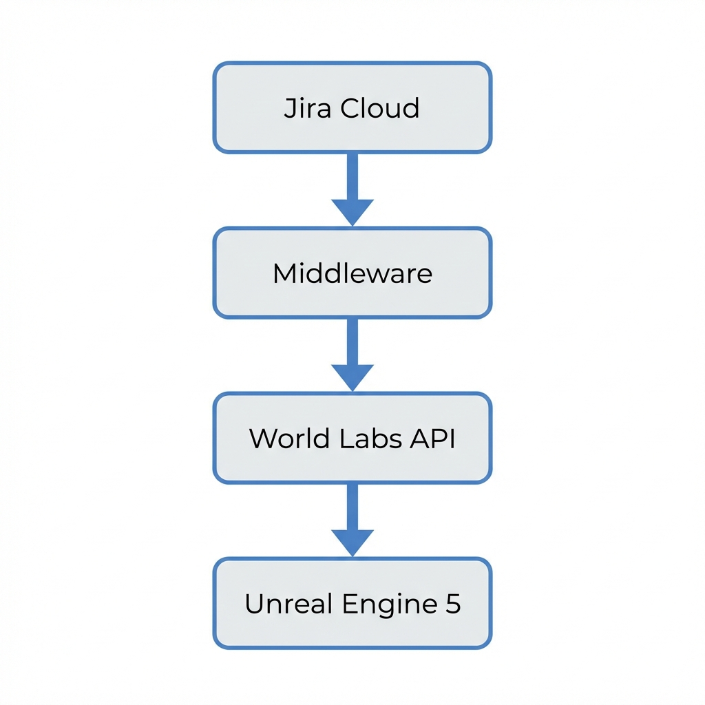

# World Labs API Analysis: Impact on BloomPath

## Executive Summary
The [World Labs API](https://www.worldlabs.ai/blog/announcing-the-world-api) ("World API") introduces a capability to **programmatically generate navigable 3D worlds** from text, images, or video. 

For **BloomPath**, this represents a paradigm shift from **"Manual Level Design with Dynamic Actors"** to **"Generative World Design"**. Instead of building a static garden where only specific elements (weather, plants) change, we could generate entirely unique environments that reflect the *essence* of the project or sprint.

## Workflow Comparison

### 1. Current Workflow: The "Static Stage"
*   **Design**: You manually build a "Garden" level in UE5 (terrain, lighting, actor placement).
*   **Dynamics**: Python middleware sends commands to specific, pre-placed actors (`GrowerActor`, `BP_WeatherManager`).
*   **Variety**: Limited to what you have programmed (e.g., stored meshes for flowers, coded weather states).
*   **Maintenance**: Adding new visual themes requires manual artist work in the Editor.

### 2. Potential New Workflow: The "Infinite Stage"
*   **Design**: The "Level" does not exist until the Sprint starts.
*   **Generation**: The Middleware sends a prompt to World API based on Jira data.
    *   *Prompt Example*: "A futuristic cyberpunk city garden, rainy, neon lights" (derived from a "Tech Debt" centered sprint).
*   **Dynamics**: The entire world (terrain, buildings, atmosphere) is generated to match the context.
*   **Variety**: Infinite. Every sprint could look completely different.

## Key Opportunities for BloomPath

### A. Context-Aware Environments
Instead of just changing `Set_Weather` to "stormy", we could generate a world that *is* a stormy coastline.
*   **Use Case**: If a sprint has many "Bug" type issues, generate a "Swamp" environment. If it has many "Features", generate a "Construction Site" or "Future City".
*   **Workflow Change**: Add a `generate_sprint_world()` step in the middleware that runs at the start of a sprint (during `sync_initial_state`).

### B. "Epic" Visualization
Currently, Epics are just "Trunks". With World API, an Epic could be an entire **island** or **zone**.
*   **Use Case**: A project with 3 Epics generates 3 distinct islands connected by bridges.
*   **Workflow Change**: Middleware analyzes Epic themes (via LLM summary of descriptions) -> World API -> Spawn zones in UE5.

### C. Text-to-World from Requirements
Use the actual text of the Jira Sprint Goal to generate the world.
*   **Input**: Sprint Goal: "Launch the MVP for the mobile app."
*   **Generated World**: A rocket launch pad environment.

## Technical Feasibility & Challenges

### 1. Runtime Import (The Big Hurdle)
*   **Challenge**: UE5 is not designed to import raw 3D world geometry at runtime easily without plugins (like `glTFRuntime` or `USDImporter`). World API likely outputs standard formats (USD, GLTF, OBJ).
*   **Solution**: We would need to integrate a runtime importer into the BloomPath UE5 project to load these generated assets on the fly.

### 2. Latency
*   **Constraint**: World generation is "asynchronous" and likely takes seconds to minutes.
*   **Impact**: Real-time updates (like "Watering a plant") should remain as they are (Remote Control API). World generation should be reserved for **macro** events (Sprint Start, Project Creation).

### 3. Collision & Navigation
*   **Challenge**: The generated world needs collision data for the player to walk around.
*   **Impact**: Runtime generated meshes need dynamic collision generation enabled in UE5.

## Recommendations

1.  **Stick to Current Path for "Micro" Dynamics**: Keep the `Grow_Leaves` and `Set_Weather` logic for real-time feedback. It's fast and reliable.
2.  **Explore World API for "Macro" Context**: 
    *   **Phase 1 (Skybox)**: Use World API to generate 360° panoramas for the skybox based on sprint health (cheaper, easier to import).
    *   **Phase 2 (Level Gen)**: generating a "Base Layer" mesh for the garden to sit on, customized to the project type.

## Proposed Next Step
If you have access to the World API, we can create a **Proof of Concept**.
*   **Goal**: Generate a single static mesh from a Jira Sprint Goal and load it into UE5 as a "Statue" or "Centerpiece" in the garden.
*   **Tooling**: Extend `middleware.py` to call World API -> Download `.gltf` -> Command UE5 (via a new Blueprint) to load it.

## Visual Workflow

Here is how the proposed "Generative World" pipeline would flow:

(This diagram shows the high-level data flow. The actual implementation would involve asynchronous polling for the World generation).
