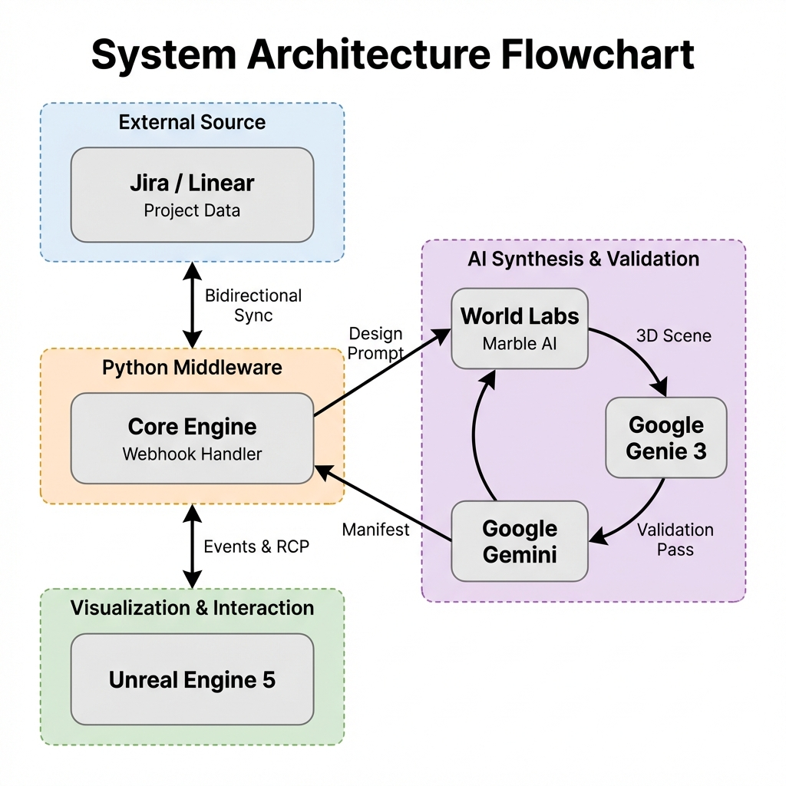

# 🌸 BloomPath: Architecture & Workflow Guide

Welcome to **BloomPath**! This document explains how the system works in simple terms. Think of BloomPath as a "living bridge" that turns your boring project to-do lists into a beautiful, growing 3D garden.

Below is the breakdown of the diverse software roles shown in our workflow diagram. We will follow a single example: **"Build a stone bridge over the river"**.

---

## 1. Project Lifecycle: From Seed to Structure
Your project board isn't just a list; it's the timeline of growth in the garden. Here is how each column interacts with the automated system:

| Column | Role in Garden (Unreal Engine 5) | What Happens? |
| :--- | :--- | :--- |
| **Backlog / To Do** | **The Seeds** | Issues here exist as dormant seeds or faint blueprints on the ground. They are potential energy waiting to be used. |
| **In Progress** | **The Growth** | **Action Trigger**: Moving here wakes up the **Python Middleware**. The **Architect (Marble AI)** begins generating the 3D model (the bridge). You might see scaffolding or growing vines in the garden. |
| **In Review** | **The Inspection** | **The Inspector (Gemini 3 Flash)** analyzes the world via Vision. If the design matches the intent, it generates a semantic manifest. If issues are detected, it marks the scene with visual warnings. |
| **Done** | **The Bloom** | **Final State**: The world segment solidifies. It is now a functional part of the environment that users can interact with. |

---

## 2. The Coordinator: Python Middleware
**Role: The "Gardener"**

This is the hidden brain of the operation. It connects your project management tool to the AI world.
- **What it does**: It watches the columns. When "FEATURE-101" moves to **In Progress**, it shouts, "Start building!"
- **Workflow**: "Okay, the user is working on a **stone bridge**. Creative Team, I need a visualization *now*."

## 3. The AI Creative Team (Synthesis & Analysis)
This is a loop where advanced AIs work together to build and verify your world.

### A. World Labs (Marble AI)
**Role: The "Architect"**
- **Job**: It takes the text "Stone Bridge" and imagines a 3D structure.
- **Example Action**: It creates the actual 3D geometry of a sturdy, arched stone bridge.

### B. Google Gemini 3 Flash
**Role: The "Inspector & Validator"**
- **Job**: Gemini 3 Flash uses its Agentic Vision capabilities to analyze the generated 3D segment.
- **Example Action**: It looks at the bridge and tags it: *"Material: Stone", "Style: Ancient", "Function: Walkable"*. 
- **Validation**: It verifies that the generated output matches the original Jira/Linear intent. It writes a **Manifest** (a digital shipping label) so the garden knows exactly how to configure physics and interaction in UE5.

## 4. The Destination: Unreal Engine 5
**Role: The "Garden"**

This is what you see on your screen. It is a high-quality 3D video game engine.
- **Experience**: You walk around and watch your work come to life.
- **Feedback**: The state of the garden tells you the health of the project. A garden full of ghosts means lots of work is "In Review" or failing tests. A garden of stone bridges means lots of work is "Done".
