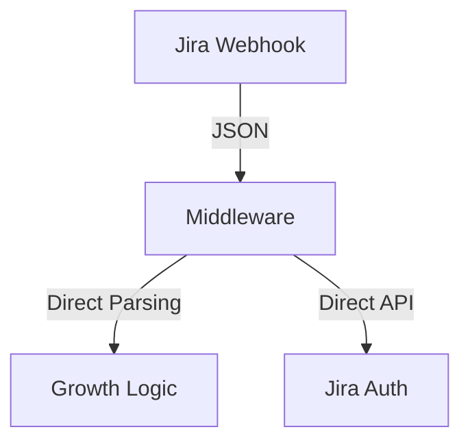
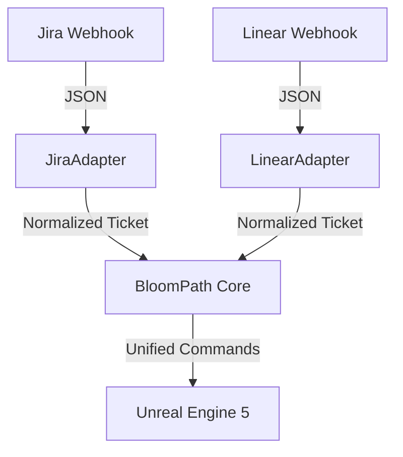

# Feasibility Analysis: Linear Integration

## Executive Summary
Integrating Linear alongside Jira is **Feasible** and highly recommended to evolve BloomPath into a true "Meta-Organizational" Digital Twin. However, the current architecture is tightly coupled to Jira's data models and requires significant refactoring to introduce an abstraction layer.

**Effort Estimate**: Medium-High (3-5 days)
**Complexity**: High (Data Normalization)

---

## 1. Architectural Impact

### Current State (Jira-Coupled)

The middleware currently hardcodes Jira-specific fields (`issue.fields.status.name`, `customfield_10016`).

### Proposed State (Adapter Pattern)


## 2. Required Changes

### A. Data Normalization (The "Rosetta Stone")
We must define a unified `Ticket` Data Transfer Object (DTO) that both providers map to:

| Field | Jira Source | Linear Source | Unified DTO |
| :--- | :--- | :--- | :--- |
| **ID** | `key` (KAN-123) | `identifier` (LIN-456) | `id` |
| **Title** | `fields.summary` | `title` | `title` |
| **Status** | `fields.status.name` | `state.name` | `status` (Todo, InProgress, Done) |
| **Type** | `fields.issuetype.name` | `labels`? | `type` (Bug, Feature, Chore) |
| **Priority**| `fields.priority.name` | `priority` (Int) | `priority` (Normalized 1-5) |

### B. Middleware Refactoring
1.  **Split Webhooks**:
    *   `POST /webhooks/jira` -> `JiraProvider`
    *   `POST /webhooks/linear` -> `LinearProvider`
2.  **Abstract Provider Class**:
    ```python
    class IssueProvider(ABC):
        def parse_webhook(self, payload): ...
        def get_sprint_health(self): ...
        def mark_as_done(self, ticket_id): ...
    ```

### C. Linear Specifics
*   **GraphQL API**: Linear uses GraphQL, requiring a different client library (e.g., `requests` with query strings or `gql`).
*   **Webhooks**: Linear webhooks sign payloads with `x-linear-signature` (HMAC), which is good for security.
*   **Cycles vs Sprints**: Linear uses "Cycles". We need to map `Cycle` -> `Sprint` for the weather system.

## 3. Feasibility Assessment

| Component | Difficulty | Notes |
| :--- | :---: | :--- |
| **Webhooks** | 🟢 Easy | Linear webhooks are clean and well-documented. |
| **Auth** | 🟢 Easy | Simple API Key or OAuth. |
| **Simulations** | 🟡 Medium | Orchestrator prompts need to handle Linear's simpler data model (often less description text). |
| **2-Way Sync** | 🔴 Hard | "Watering" in UE5 requires mapping a UUID back to the correct provider to trigger the API call. |

## 4. Recommendations

1.  **Phased Rollout**:
    *   **Phase 1**: Ingest only (Linear -> UE5). Treat Linear issues as simple "Leaves".
    *   **Phase 2**: Full Provider Abstraction (Refactor `middleware.py` to use Adapters).
    *   **Phase 3**: Bidirectional (UE5 water -> Linear "Done").

2.  **Hybrid ID System**:
    UE5 actors currently use the Issue Key (e.g., `KAN-123`) as their name. Linear keys look like `LIN-123`. This works out of the box! No namespace collision expected if keys are unique prefixes.

3.  **Go/No-Go**: **GO**.
    Adding Linear proves the "General Purpose" nature of the L3 Dreaming Engine. It decouples the intelligence from the specific tool.
